# Estimation Project #

## Result at each step. ##

### Step 1. Sensor Noise ###

Excute simulator in scenario '06_SensorNoise'. Then it will generate 2 files record GPS and IMU.
I used code below to process these infomations and calculate standard deviation for GPS and IMU sensors.
 [Calculate_std_IMU.ipynb](./Calculate_std_IMU.ipynb)
 
 This is result when i run code:
 
 - GPS Std: 0.71
 - IMU Std: 0.488
 
 Result when i re-run simulator in scenario '06_SensorNoise'
 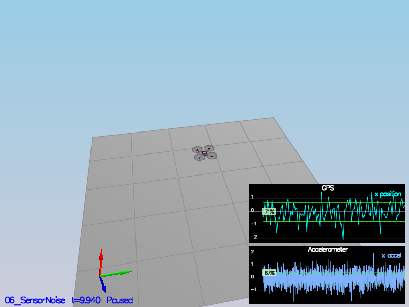
 
 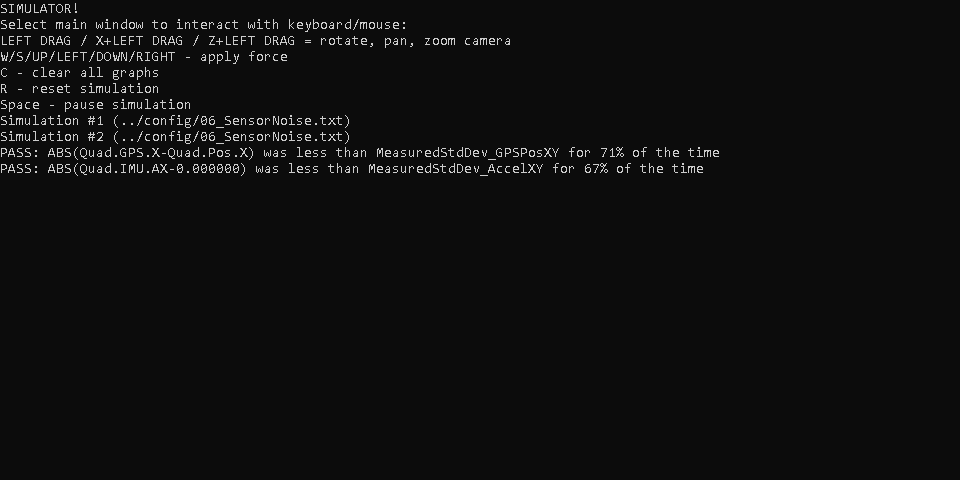
 
### Step 2. Attitude Estimation ###

This step i need complete function `UpdateFromIMU()` (in line 74-129)
We need to implement a non-linear one to get good results. I used equation below (from controller project):

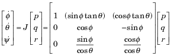

And then use knowledge from section 7.2 of [Estimation for Quadrotors](https://www.overleaf.com/read/vymfngphcccj) to complete function `UpdateFromIMU()` with non-linear version.

This is result when i run scenario `07_AttitudeEstimation`
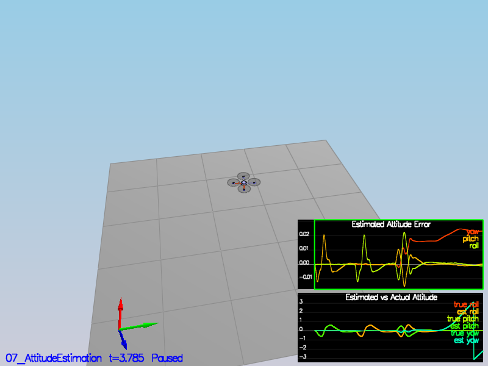

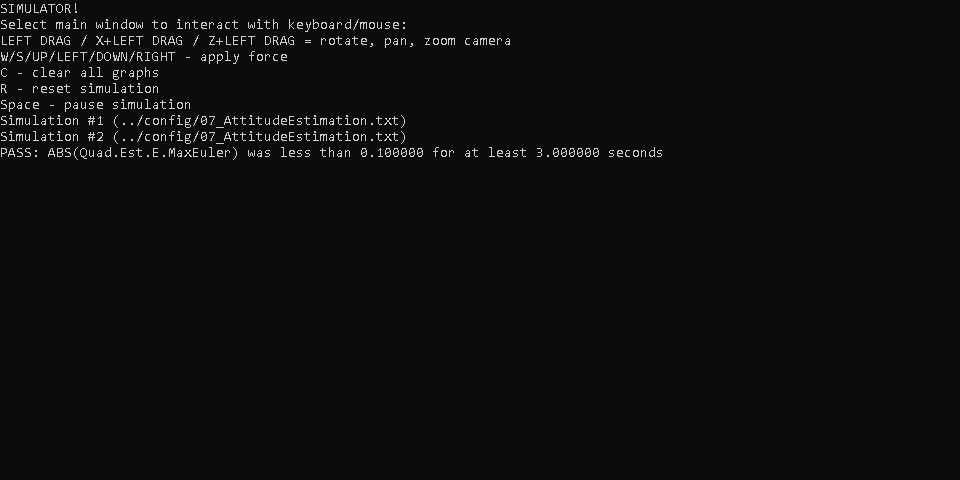

### Step 3. Prediction Step ###

#### 1. Predict ####

In that step, we predict current state from previous state and acceleration measurement.
Use equation (49) in section 7.2 of [Estimation for Quadrotors](https://www.overleaf.com/read/vymfngphcccj) to complete fuction `PredictState` (in line 154-190)

Result when i run scenario `08_PredictState`

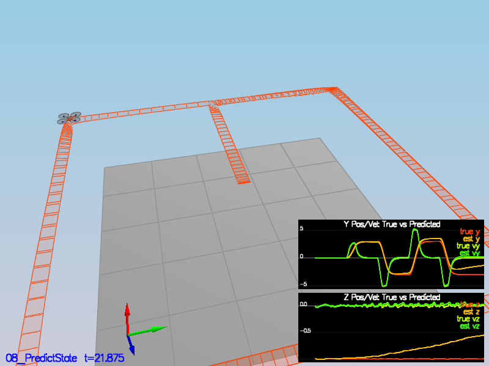
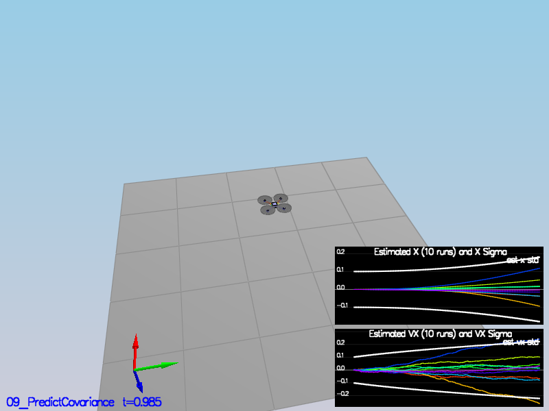

#### 2. Check the magnitude of the error ####

Run scenario `09_PredictCovariance` to check the magnitude of the error.
Result

### Step 4. Magnetometer Update ###

Use EKF (section 7.3.2 of [Estimation for Quadrotors](./images/https://www.overleaf.com/read/vymfngphcccj)) to combine predict yaw (from fuction `UpdateFromIMU`) with measurement yaw (from Magnetometer). And then update this value in function `UpdateFromMag`.

Beside, tune the parameter QYawStd (QuadEstimatorEKF.txt).

Result when i run scenario `10_MagUpdate` to test this function. (in line 343-370).

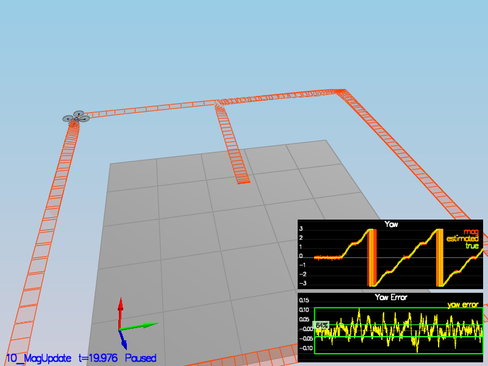
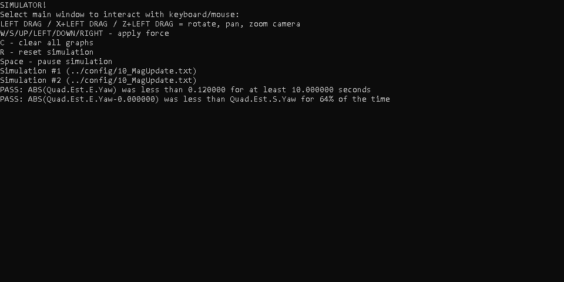

### Step 5. Closed Loop + GPS Update ###

I set SimIMU.AccelStd & SimIMU.GyroStd like below:

`#SimIMU.AccelStd = 0.1,0.1,0.1`
`#SimIMU.GyroStd = 0.1,0.1,0.1`

And then i used equation (49) in section 7.3.1  of [Estimation for Quadrotors](https://www.overleaf.com/read/vymfngphcccj) to complete fuction `UpdateFromGPS` (in line 307-341).

Result when i run scenario `11_GPSUpdate` to test this function.

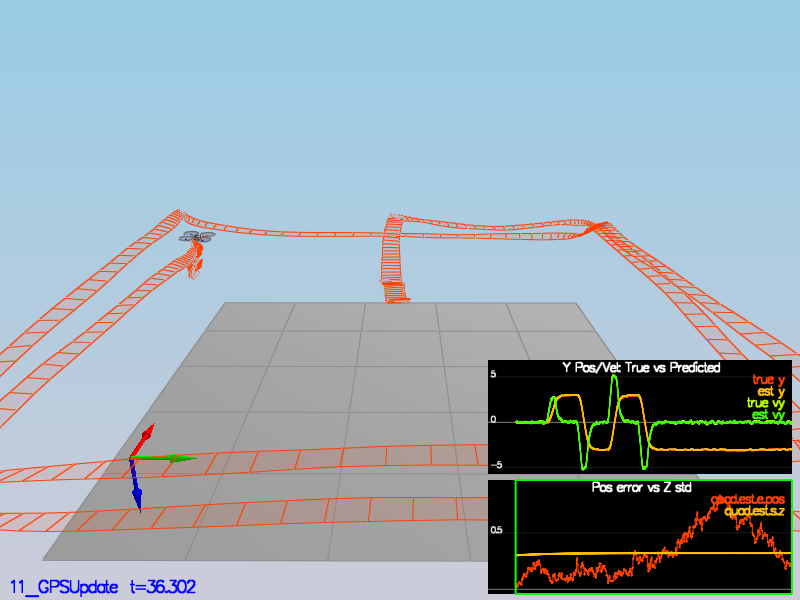

### Step 6. Adding My Controller and test again scenario from previous project. ###

`02_AttitudeControl`

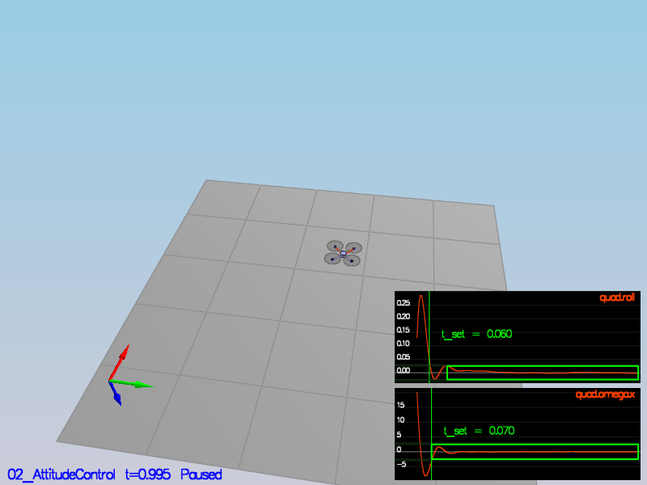
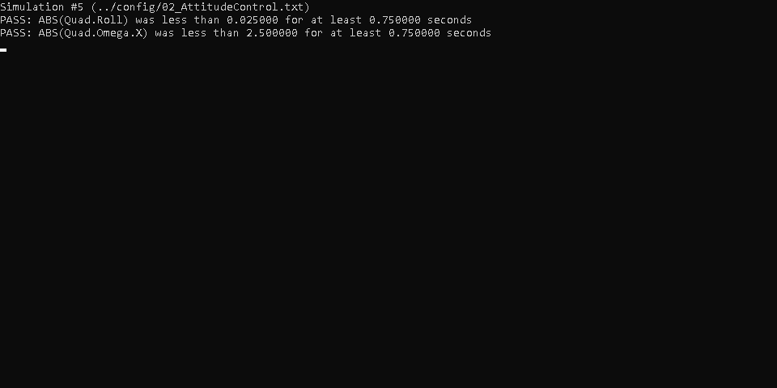

`03_PositionControl`

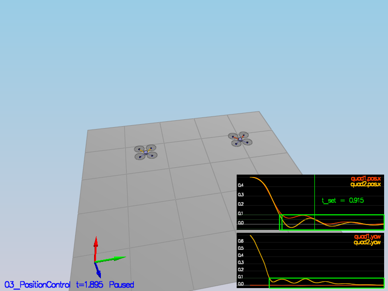
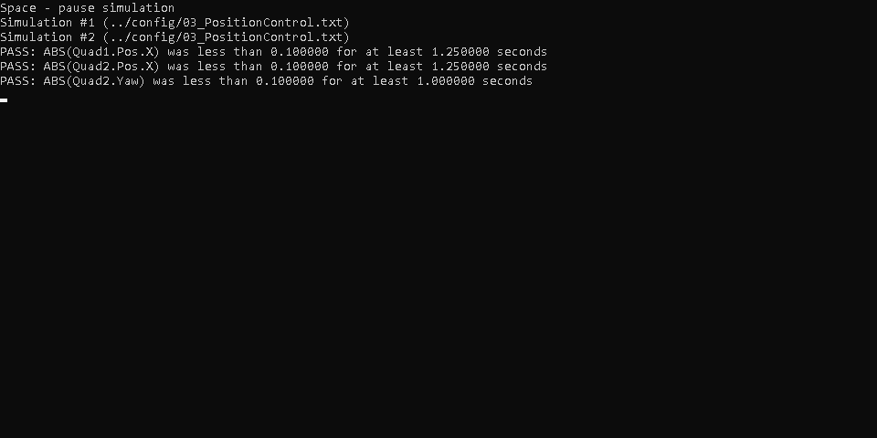

`04_Nonidealities`

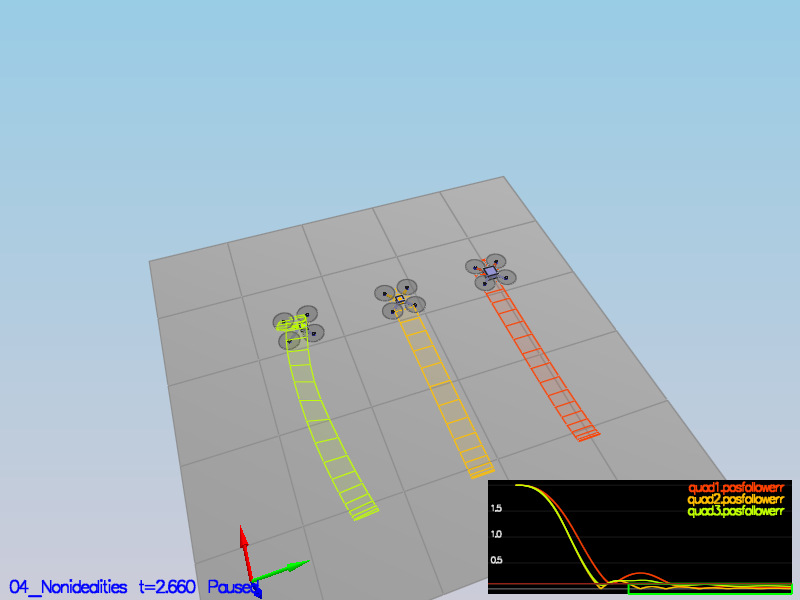
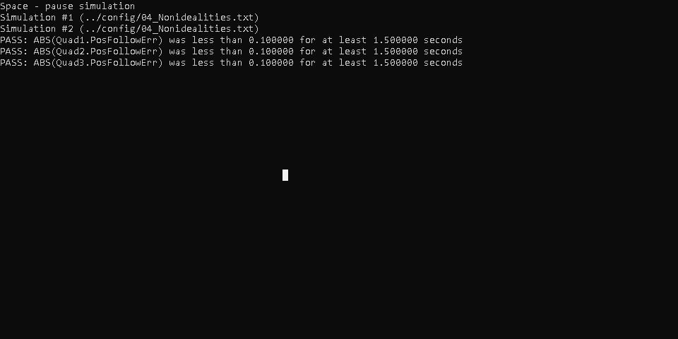

`05_TrajectoryFollow`

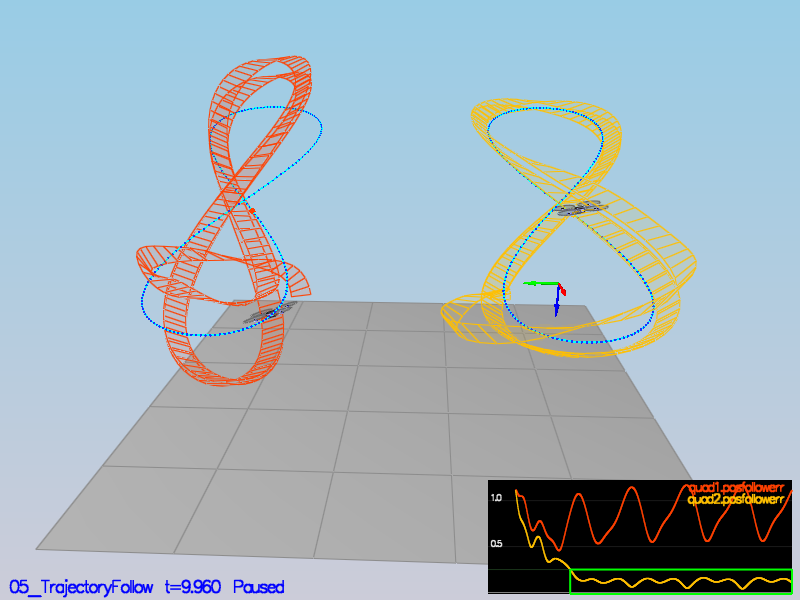
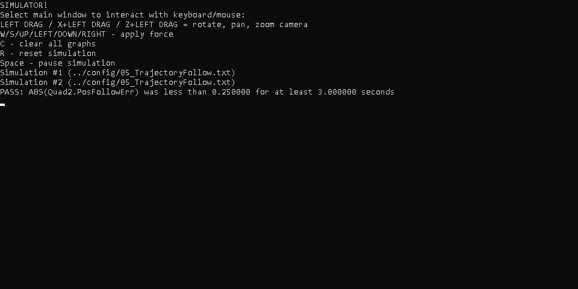

